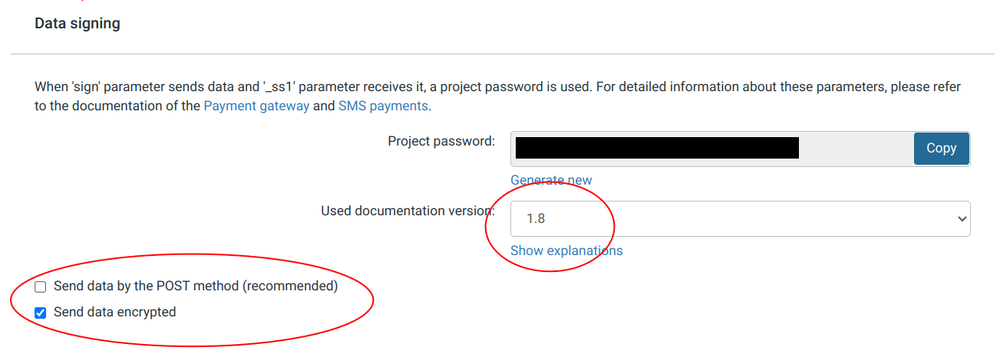

# WebToPay (Paysera) .NET library
This is a library that helps applications to integrate with Paysera payment provider. It mainly helps with two things - payment initiation and response from Paysera (callback) handling.

You can read more about how the payment process works on Paysera's website for developers - https://developers.paysera.com/en/checkout/basic


## Required Paysera Settings
The library currently uses 1.8 specificaton. Under "General project settings" select your project to use 1.8 version specification. Also, tick "Send data encrypted" checkbox.



## How To

To use the library, compile the code or use NuGet package `Syn.WebToPay`.

Most projects utilizes depencency injection, for that reason, there is a package `Syn.WebToPay.DependencyInjectionExtensions` use this package to use Microsoft's DI and add `builder.AddWebToPay();` (where `builder` is `IHostApplicationBuilder`). This will also try to get WebToPayOptions from options provider. Add it to your appsettings like this:
```
  "WebToPayOptions": {
    "SignPassword": "password",
    "ProjectId": 0000000,
    "TestMode": false
  }
```
Note: in order to use TestMode, you will need to enable it in Paysera's website by ticking the **Allow test payments** checkbox

If you do not use DI, you will have to initialize `CallbackClient` and `PaymentInitiationClient` manually.

The full payment flow is in the example project but here is the general idea:
1. You need to create a payment initiation URL, to do that call `_paymentInitiationClient.NewRequest()`, the object you receive from this method call is the options object for this payment, you should set the email, amount you want to charge, order id, accept, cancel and callback URLs, etc. 
2. Call `_paymentInitiationClient.BuildRequestUrl(request);` with the request object you modified before. You will get the URL, user will need to be redirected to this URL to complete the payment.
3. After user completes the payment you will get a call from Paysera to your callback URL you have set before. The callback will have "data" parameter which is encrypted information about the payment. Use libraries methods to get the information about payment status. e.g.
```
        string queryDataString = callbackClient.GetDataFromQuery(queryValues);
        CallbackData callbackData = callbackClient.GetMacroCallbackData(queryDataString);
``` 
Don't forget to check the payment amount, currency and status in `callbackData` before assuming the payment was successful. More information about data that comes from callback can be found in Paysera's website.

## Collaborating
Feel free to create a pull request or a github issue.

## Contacts
You can find me at mantas.pau(at)gmail.com
